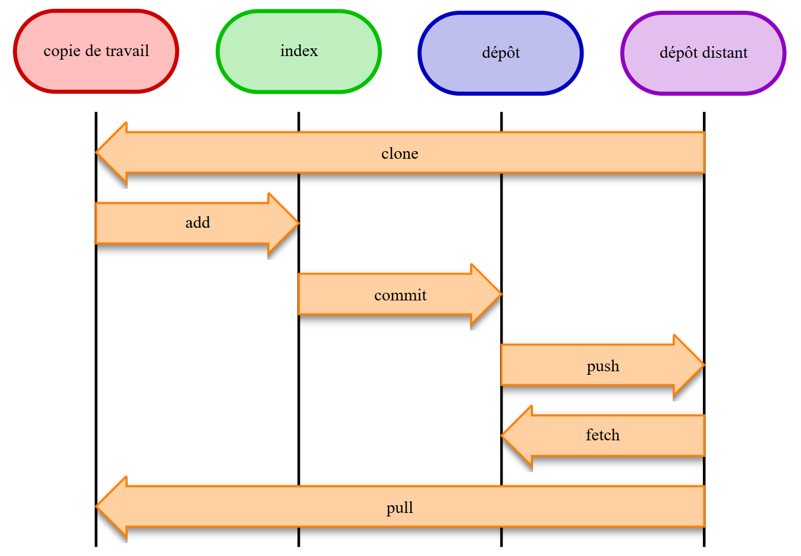

# Utilisations basique et commandes principales :

## Table of content

- [Vue d'ensembe d'un repo](#vue-densembe-dun-repo)
- [`git add`](#git-add)
- [`git status`](#git-status)
- [`git commit`](#git-commit)
- [`git push`](#git-push)
- [`git pull`](#git-pull)
- [`git remote`](#git-remote)
- [`git diff`](#git-diff)
- [`git log`](#git-log)

## Vue d'ensembe d'un repo

Un repo est globalement divisé en 4 parties :

### 1. **Copie de travail** (**working tree**)

C'est le contenu présent sur le disque, ce que tu peux éditer en créant, supprimant ou modifiant un fichier.

### 2. **Index** (**staging area**)

La zone intermédiaire avant le commit. Elle permet de sélectionner ce que tu veux mettre dans un commit avec [`git add`](#git-add) avant de le commit

### 3. **Dépôt local** (**local repository**)

Tout ce qui a été ajouté "définitivement" au repo git est présent ici.  
On retrouve dans le dossier `.git` à la racine du repo, tous les commits, toutes les branches, les tags, etc.  
Les modifications y sont ajoutées avec la commande [`git commit`](#git-commit) depuis l'index.

### 4. **Dépôt distant** (**remote repository**)

C'est la copie externe du repo présent localement sur ta machine.  
Désigné par la `remote` (voir [`git remote`](#git-remote)) le dépôt distant permet de centraliser toutes les modifications depuis le début du projet. Ca permet simplement d'avoir un seul endroit commun où partager ses modifications.  
Il existe beaucoup de services de gestion de dépôt distant, bien le plus connnu soit GitHub un grand nombre d'alternatives existent. GitLab, Bitbucket, SourceForge, ... Si tu possèdes un serveur il est même possible d'héberger facilement le tien avec la commande git uniquement.



> ###### sources : [Introduction à GIT](https://perso.liris.cnrs.fr/pierre-antoine.champin/enseignement/intro-git/#vue-d-ensemble)

## `git add`

`git add` permet d'ajouter les **modification** apportées aux fichiers et dossiers spécifiés à l'index.  
Des **modifications** sont tout ce qui change le projet que ce soit créer, écrire ou supprimer un fichier.  
Cette commande agit récursivement ce qui permet d'ajouter tous les fichiers et dossier présent dans un dossier sécifié.

Example :

```bash
# Ajoute le dossier actuel et tous ses fichiers/sous-dossiers récursivement
git add .

# Ajoute les fichiers sélectionner
git add file1 file2 dir1/file3
```

#### Suppression de fichiers

Une suppression est une **modifications** de l'index, pour que git _comprenne_ que le fichier est supprimé il faut [`git add`](#git-add) manuellement le nom du fichier supprimé ou l'un de ses dossiers parent.

Example :

```bash
# Supprime le fichier du working tree
rm dir1/file3

# Ajoute cette suppression à l'index
git add dir1/file3
# OU
git add dir1
```

> [!NOTE]
>
> #### `.gitignore`
>
> Le `.gitignore` permet de spécifier des fichiers/dossiers à ne pas ajouter automatiquement à l'index avec [`git add`](#git-add).  
> Il peut y en avoir plusieurs dans différents dossiers d'un repo et ils agiront tous sur leur dossier et tous ses sous-dossiers.

## `git status`

La commande `git status` est une manière simple et efficace d'avoir des infos sur l'état actuel du repo. Vous pouvez y voir :

- La branche actuelle
- L'état de la branche locale par rapport à celle sur le repo remote
- Les modifications apportées au fichiers ajoutées à l'index
- Les modifications apportées au fichiers du working tree par rapport à l'index.  

C'est une bonne manière pour avoir une vue d'ensemble du repo pour préparer ses commits et les pushs/pull fait sur la remote.
